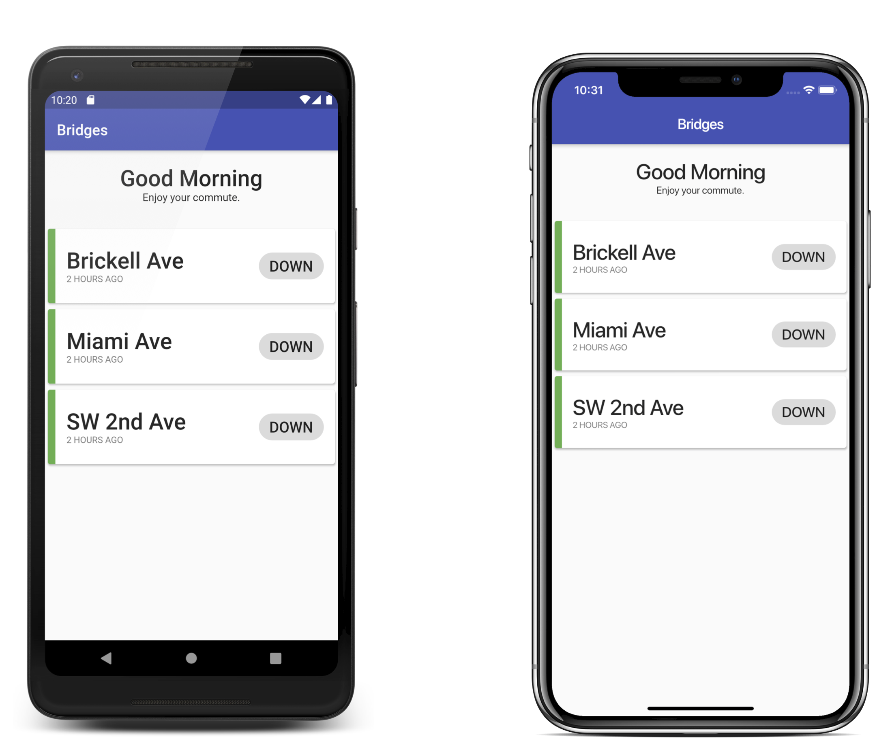

# Miami Bridges
iOS and Android App to quickly check the status of the Downtown/Brickell bridges in Miami.

If you have an idea on how to make this better, feel free to open a PR!

## Screenshots

## Bridges
There are three bridges currently supported:

- Brickell Avenue
- Miami Avenue
- SW 2nd Avenue

## Technology

## Framework
This app is built with Google's Flutter Framework - it's the reason this app is available on both iOS and Android.

## API
This app uses the [BridgeForecast.com API](https://bridgeforecast.com) to display the status for each bridge.

All credit for the ability to show these statuses at all goes to BridgeForecast.com - thank you!